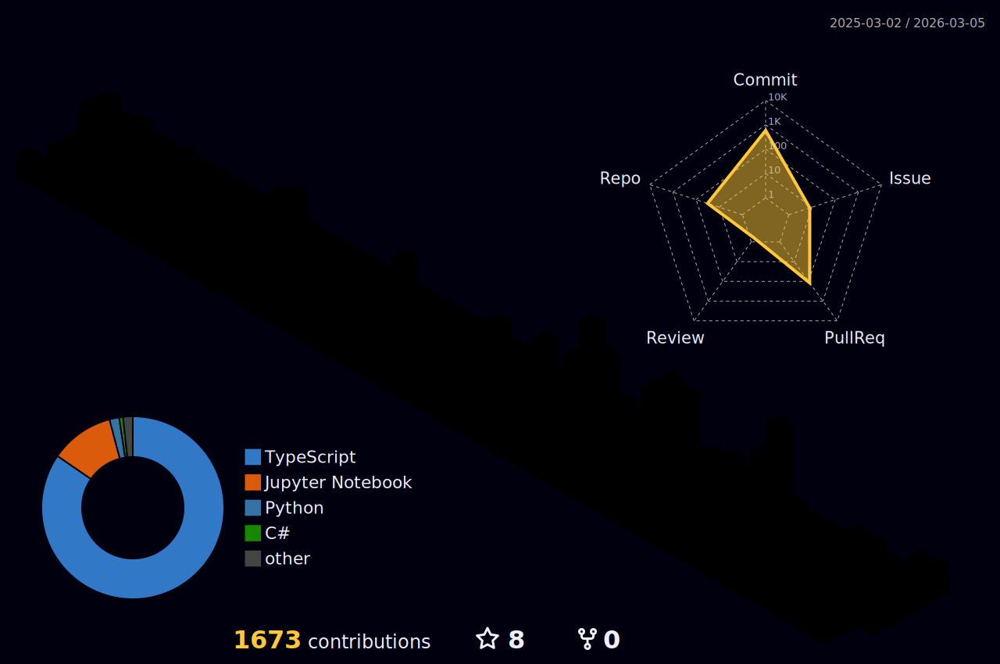

# zxzinn

**Systems · Security · AI**

---

### 📊 Statistics

---

### 🛠️ Stack

**Languages** · Rust · Python · TypeScript · Java
**AI/ML** · PyTorch · TensorFlow · Hugging Face · LangChain
**DevOps** · Docker · Kubernetes · GitHub Actions

---

### 🎓 Certifications

- Ethical Hacking Essentials (EHE)
- Network Defence Essentials (NDE)
- Microsoft Azure AI Fundamentals (AI-900)
- DevCore Information Security Scholarship

---

