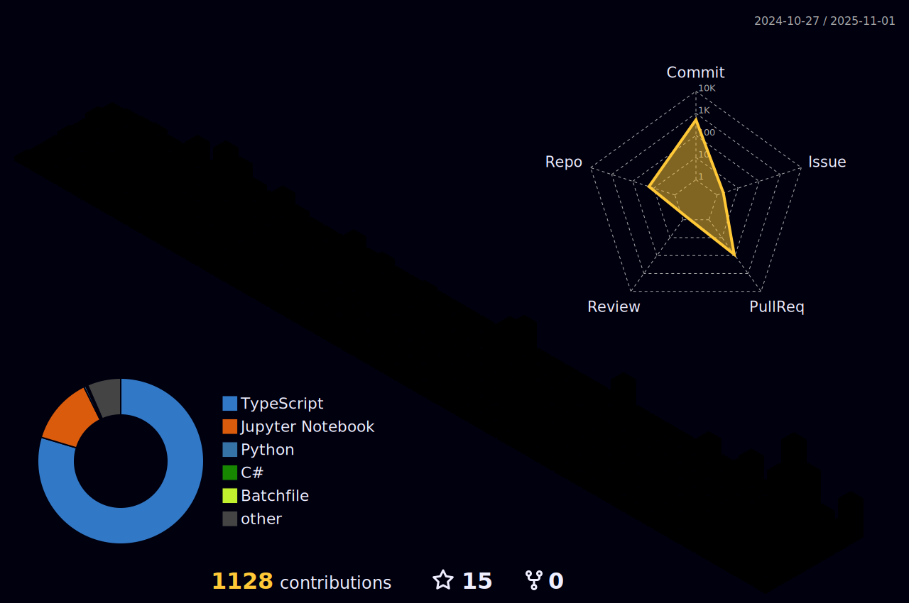

<!-- Minimalist Wave Header -->


<!-- Subtle Typing Animation -->
<p align="center">
  
</p>

<!-- Social Links -->
<p align="center">
  <a href="https://linkedin.com/in/zxzinn">
    
  </a>
  <a href="https://github.com/zxzinn">
    
  </a>
  
</p>

<!-- About Section -->
### About

```rust
struct Developer {
    languages: Vec<&'static str>,
    interests: Vec<&'static str>,
    current_focus: &'static str,
}

impl Developer {
    fn xinn() -> Self {
        Self {
            languages: vec!["Rust", "Python", "TypeScript", "Java"],
            interests: vec!["Systems", "Security", "AI/ML", "Architecture"],
            current_focus: "Secure distributed systems",
        }
    }
}
```

<!-- Tech Stack with Icons -->
## Tech Stack

<div align="center">

### Languages


### AI & Machine Learning


### DevOps & Tools


</div>

<!-- GitHub Stats -->
<div align="center">
  
  
</div>

<!-- Certifications -->
## Certifications

<details>
<summary>View Certifications</summary>
<br>

- Ethical Hacking Essentials (EHE)
- Network Defence Essentials (NDE)  
- Microsoft Azure AI Fundamentals (AI-900)
- DevCore Information Security Scholarship

</details>

<!-- 3D Contribution Calendar -->
## Contributions

<div align="center">
  
</div>

<!-- Footer Wave -->
